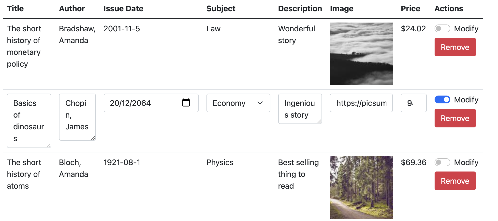
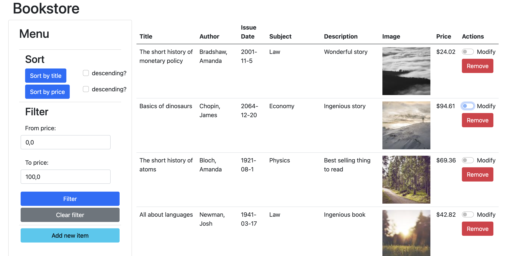

Table of Contents
- [Setup](#setup)
- [Usage](#usage)
- [Description](#description)
  - [PureScript language](#purescript-language)
  - [Halogen framework](#halogen-framework)
- [Source code walkthrough](#source-code-walkthrough)
  - [BookTable.purs](#booktablepurs)
  - [About.purs and About.js](#aboutpurs-and-aboutjs)
  - [Types.purs](#typespurs)
  - [Utils.purs](#utilspurs)
  - [Main.purs](#mainpurs)


# Setup

Install latest release or clone
```
https://github.com/Swordlash/ZAI-JS.git
```

To setup, run `npm install`. This will download all dependencies for the project (JavaScript and PureScript).


# Usage

To build the project and open server, run `npm run start`. This will cause the bundle to compile and open http server (on local port 8080 or any higher port that's free).


# Description 

## PureScript language

[PureScript](https://www.purescript.org/) is a functional, strongly, statically-typed language similar to Haskell. The `purs` compiler transpiles the `.purs` source to `.js` output, which is then run in browser. There are plans to implement alternate backends, i.e. WASM, which requires the WASM-GC proposal to be implemented.

As I said, PureScript is a strongly, statically-typed language. In practice it means that types of all variables are checked at compile-time. This approach practically eliminates runtime errors. In my experience with programming in PureScript, the only sources of runtime errors are foreign calls to JavaScript. The need of program to typecheck before run may seem a small inconvenience at first, but hugely benefits code maintenance and stability.

PureScript is strongly typed, which means that unlike in TypeScript, you cannot write a program that i.e. fails with `cannot read property X of undefined`. The only way to embed untyped JS code in PS is via foreign calls, and those calls have to be type-annotated at an import site. PS doesn't have an ability to check correctness of those annotations, therefore those are the only places where a runtime error can occur.

PureScript is functional, which roughly speaking means that all declared functions are functions in a mathematical sense, so that the output of function is determined only by its input, and not by a global, hidden state. Any effectful action has to be embedded into one of `Effect` or `Aff` monads. This concept greatly influences maintenance difficulty and code reasoning. For instance, you may reason about functions looking only at their type declarations. Consider

```
id :: forall a. a -> a

-- | Either - a "sum type" meaning we have a Left something of type a, or Right something of type b
data Either a b = Left a | Right b 

loop :: forall a b. (a -> Either a b) -> a -> b
```

It can be proven (!) that the only terminating implementations of those functions are:
```
id x = x

loop f x = case f x of
  Left x' -> loop f x'
  Right y -> y
```

Those properties make code refactoring easy even for junior developers which have a first contact with a codebase. Types drive you along a way.

## Halogen framework

[Halogen](https://github.com/purescript-halogen/purescript-halogen) is a main PureScript library for creating user interfaces. It uses [the Elm architecture](https://guide.elm-lang.org/architecture/) (i.e. `Model-View-Update`) to control the flow of execution in UI programs. A component is created via a `mkComponent` function, which transforms a `ComponentSpec` into an abstract component:

```
type ComponentSpec state query action slots input output m = 
  { initialState :: input -> state
  , render :: state -> HTML (ComponentSlot slots m action) action 
  , eval :: (HalogenQ query action input) ~> (HalogenM state action slots output m)
  }
```

As stated in Elm architecture, we have an `initialState` function with initializes `state` given component's `input` (`Model`. We also have a `render` function with renders the components according to its state (`View`) and `eval`, which dispatches any events that are raised in a component (`Update`). The type parameters of `ComponentSpec` describe which actions are handled by the component, what are the component's children and how does the component interact with other components and the real world.

A component created this way is then run by a function `runUI`, which attaches the component to an element on a page given as an argument, typically to the `<body>` (but not necessarily; this way we can embed PS components in an otherwise React application).


# Source code walkthrough

The code is divided into four modules: `BookTable`, `Types`, `Utils` and `Main`.

## BookTable.purs

The `BookTable` module implements a component that renders a collection of `Book`s. The component receives a `Books` object to render from the parent component and raises any modification/deletion events. A main function is the `render` function, which creates a table. Each `Book` in the collection is rendered as a HTML row, according to whether it is currently modified or not (governed by a check button in the last column).



## About.purs and About.js

Render this README into the HTML viewport.

## Types.purs

The `Types` module declares all custom types used in the application, along with necessary typeclass instances. A type that is central here is a `Book` type:

```
newtype Book = Record
  ( title       :: Title
  , description :: Description
  , imageUrl    :: URL
  , price       :: Money
  , author      :: Author
  , subject     :: Subject
  , issueDate   :: IssueDate
  , id          :: Int
  , modifyMode  :: ModifyMode
  )
```

Also, the `Types` module describe how to generate example data for all types (through `Arbitrary`) instances. PureScript does not support orphan instances, therefore instance declarations have to be written in the same module as type declarations. Hence, the `Types` module is quite lengthy. Notice the extensive usage of generic programming - PureScript knows how to generate an arbitrary `Book` when told how to generate its components:

```
derive instance Generic Book _

instance Arbitrary Book where
  arbitrary = genericArbitrary
```

This is a power of statically-typed languages.

## Utils.purs

`Utils` module contains three short utility functions that didn't fit into any other modules.

## Main.purs

The `Main` module implements the main parent component of the application, and attaches it to the `<body>` element in `main` function. It embeds the `BookTable` child component, dispatches modification/deletion events from it and adds a context menu that allows for books sorting and filtering:

